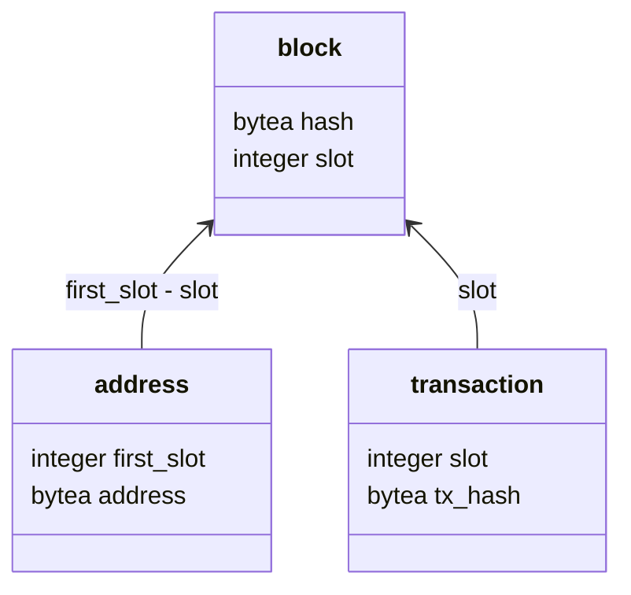

<p align="center"></p>

# CAB Backend
Custom backend for CAB, written in TypeScript using PostgreSQL for data storage. Core highlights

- ⚖️ Light-weight, syncs the bare minimum - block slots and hashes, tx hashes of submitted transactions, and used addresses
- ♻️ For other data uses [Ogmios Ledger State Queries](https://ogmios.dev/mini-protocols/local-state-query/), such as UTxOs, protocol params, or current reward account summaries
- 🚀 Fast to sync data, preprod can be synced from Genesis in under 15 minutes on a laptop


## Why another indexer / backend service?
We evaluated other alternatives out there and from those none just fit our needs. We use CAB with our backend mainly for agents (off-chain component to smart contracts) and enabling users to connect directly with Ledger / Trezor to our dApp. With that in mind:
- [cardano-db-sync](https://github.com/IntersectMBO/cardano-db-sync) is a monolith and great when you need all the data from the blockchain in a DB, however it takes up a lot of space and resources and is not the cheapest to run.
- [kupo](https://github.com/CardanoSolutions/kupo) is nice, but lacked some features around address discovery that we wanted
- other indexers we evaluated were also either too feature-full for our needs or too minimal

We came to the conclusion that we actually don't need an indexer of all UTxOs as we can just use the State Query from Ogmios. Yes, we acknowledge that querying UTxOs from Ogmios can be slower than for example querying them from an indexer like Kupo. However, the difference is not terrible and with the non-frequent usage of the backend it actually makes sense to cut down on storage costs in favor of slighlty slower UTxO queries.

So the resulting backend is a bundle of a simple indexer, that aggregates used addresses, tx hashes of submitted transactions, and a wrapper around some required Ogmios queries. This results in a relatively low-profile, easy to maintain, and fast backend.


## API
### Get protocol parameters
#### Request
`GET /protocolParameters`

#### Response
**Code:** 200

**Content Example**
```json
{
    "minFeeCoefficient": 44,
    "minFeeConstant": {
        "ada": {
            "lovelace": 155381
        }
    },
    "maxBlockBodySize": {
        "bytes": 90112
    },
    ...
    "collateralPercentage": 150,
    "maxCollateralInputs": 3,
    "version": {
        "major": 8,
        "minor": 0
    }
}
```
Return protocol parameters obtained from Ogmios, the returned type corresponds to `ProtocolParameters` from [`@cardano-ogmios/schema`](https://github.com/CardanoSolutions/ogmios/tree/master/clients/TypeScript/packages/schema)

### Get UTxOs for addresses
#### Request
`POST /utxos`

**Body:** Array of addresses in BECH32 form or in hexadecimal format
```json
{
    "addresses": [
        "addr_test1wz6zjuut6mx93dw8jvksqx4zh5zul6j8qg992myvw575gdsgwxjuc",
        "004a6518c2871c9c05a06bd6995d6e03ebd973a03d9509324abc9138347a507e54fcae6f3b497ddf679e29d170dad54905e19bbcfb7d398756"
    ]
}
```

#### Response
**Code:** 200

**Content Example**
```json
[
    {
        "address": "addr_test1qqydes3g449j3qr68hxhmr4ku7zp7cw88wk0hyl9t395hn8hs9qws4yyv92erd7zlnay2rh7va42gc7rxsm22hpn38zsayyufn",
        "index": 7,
        "transaction": {
            "id": "f61564211310e30c9aa7fc6bd12a86dc5fe94b0f907b0f9a38e6622f8d7c1e26"
        },
        "value": {
            "67e5f959b6e3700559f1c448d63bed7c365d2d3f6536fd21708aaf51": {
                "54": 47999
            },
            "882fcbd24592a24362ea55aea0c292afe75e80fd67928f7266f63229": {
                "43": 80
            },
            "a1e642ef52eb824bf0d527bf0ab6c326256263baab3c8d59c9c2829a": {
                "58": 99700
            },
            "ada": {
                "lovelace": 3385074
            },
            "ec05a96b48af6a59d9b84856e066f837120e4687ef55d3cfa7af845e": {
                "41": 99700
            }
        }
    }
]
```
Array of UTxOs as defined in [`@cardano-ogmios/schema`](https://github.com/CardanoSolutions/ogmios/tree/master/clients/TypeScript/packages/schema).

### Get reward account summary for stake key hash
#### Request
`GET /rewardAccountSummary/{stakeKeyHash}`

- `{stakeKeyHash}` - is the 28 byte staking credential as hexadecimal string

#### Success Response
**Code:** 200

**Content Example**
```json
{
    "delegate": {
        "id": "pool13m26ky08vz205232k20u8ft5nrg8u68klhn0xfsk9m4gsqsc44v"
    },
    "rewards": {
        "ada": {
            "lovelace": 131492083142
        }
    },
    "deposit": {
        "ada": {
            "lovelace": 2000000
        }
    }
}
```

#### Error Response
**Code:** 404

**Content Example**
```json
{
    "msg": "Stake key not found, or the stake key is not registered"
}
```

### Get list of used addresses for stake key hash
#### Request
`GET /addresses/{stakeKeyHash}`

- `{stakeKeyHash}` - is the 28 byte staking credential as hexadecimal string

#### Response
**Code:** 200

**Content Example**
```json
[
    "004a6518c2871c9c05a06bd6995d6e03ebd973a03d9509324abc9138347a507e54fcae6f3b497ddf679e29d170dad54905e19bbcfb7d398756"
]
```
List of addresses in hexadecimal form

### Get transaction by tx hash
#### Request
`GET /transaction/{txHash}`

- `{txHash}` - is the 32 byte transaction hash as hexadecimal string

#### Success Response
**Code:** `200`

**Content Eample**
```json
{
    "txHash": "0eaf8ec56a53b49579549833c6c761945ad5af8f3597a45a46b967c3074f930a",
    "slot": 56630505
}
```

#### Error Response
**Code:** `404`

**Content Example**
```
{
    "msg": "Transaction not found"
}
```

### Healthcheck
#### Request
`GET /healthcheck`

#### Response
**Code:** `200`

**Content Eample**
```json
{
    "healthy": true,
    "healthyThresholdSlot": 10,
    "networkSlot": 56636031,
    "ledgerSlot": 56636031,
    "lastBlockSlot": 56636031,
    "uptime": 144.16159705
}
```
- `networkSlot` - slot of the last block that the node it aware of.
- `ledgerSlot` - slot of the last block that has been processed by the ledger
- `lastBlockSlot` - slot of the last block that has been synced to the database


## Configuring
Configuring is done with env vars.
```
# Mode of operation - aggregator | server | both, default is both
MODE=both

# Port of the API server
PORT=3000

# One of "silent" | "fatal" | "error" | "warn" | "info" | "debug" | "trace"
LOG_LEVEL=info

OGMIOS_HOST=localhost
OGMIOS_PORT=1337

# Defines the connection to PostgreSQL, DB_USER, DB_PASSWORD, DB_NAME have no
# default values and must be set
DB_HOST=localhost
DB_PORT=5432
DB_USER=
DB_PASSWORD=
DB_NAME=
DB_SCHEMA=cab_backend
```


## DB Schema

<details>
<summary>See complete definition</summary>

```sql
create table if not exists block (
    slot integer not null primary key,
    hash bytea   not null
);

create table if not exists transaction
(
    tx_hash bytea   not null primary key,
    slot    integer not null
        constraint transaction_slot_block_slot_fk
            references block 
            on delete cascade
);

create index if not exists slot_idx on transaction (slot);

create table if not exists address
(
    address    bytea   not null primary key,
    first_slot integer not null
        constraint address_first_slot_block_slot_fk
            references block
            on delete cascade
);

create index if not exists payment_credential_idx on address (substr(address, 2, 28));

create index if not exists staking_credential_idx on address (substr(address, 30, 28));

create index if not exists first_slot_idx on .address (first_slot);

```
</details>


## Development
The project was created with [bun](https://github.com/CardanoSolutions/kupo). To install dependencies:

```bash
bun install
```

To start the backend with auto-reloading run:

```bash
bun dev
```

### Linting
Linting is done with [biome](https://biomejs.dev/):

```bash
# To lint the code, also checks types with tsc
bun lint

# To fix auto-fixable issues from linting
bun fix
```

<p align="center">
<a href="https://www.wingriders.com/">WingRiders</a> ·
<a href="https://community.wingriders.com/">Community Portal</a> ·
<a href="https://twitter.com/wingriderscom">Twitter</a> ·
<a href="https://discord.gg/t7CdyhK8JA">Discord</a> ·
<a href="https://medium.com/@wingriderscom">Medium</a>
</p>

